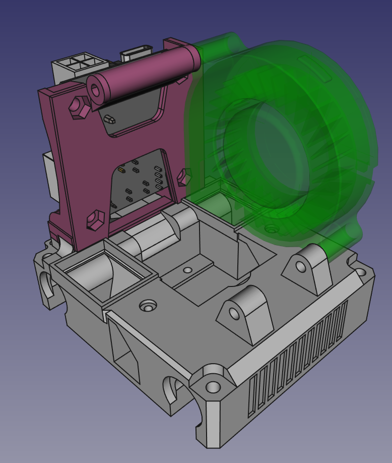
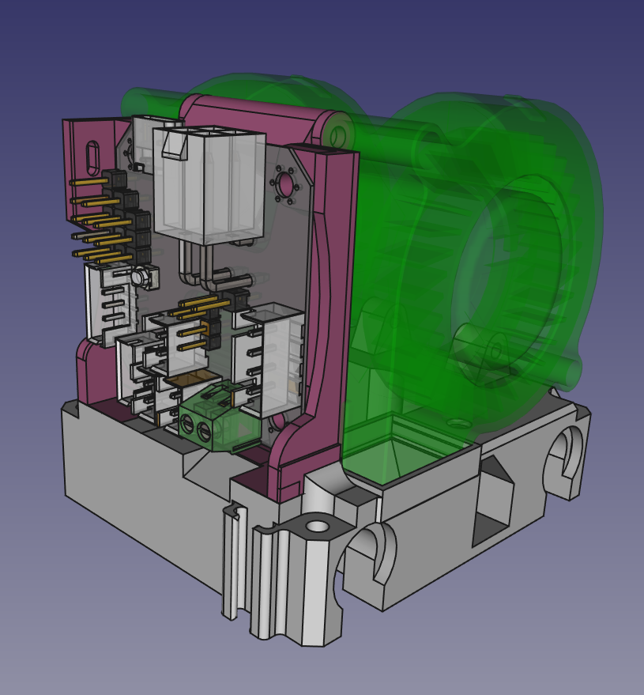

# EBB42 mount for Karas5015M project

This carriage made based on original design https://github.com/Ryoko/Karas5015M

Modifications made:

1. Removed belt wedges-in-place (should be printed separately);
2. Removed FBG6-wiring-board mount teatures;
3. EBB42 mount was added;
4. Chamfer was subtracted for easier heater wiring;

## Fan side preview
 

## PCB module side preview

